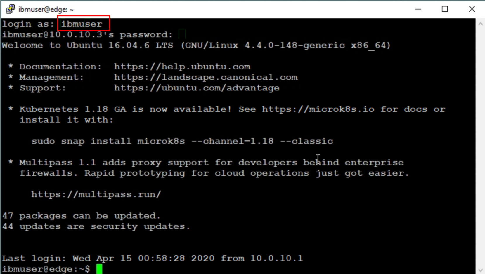
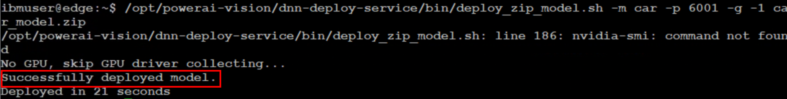
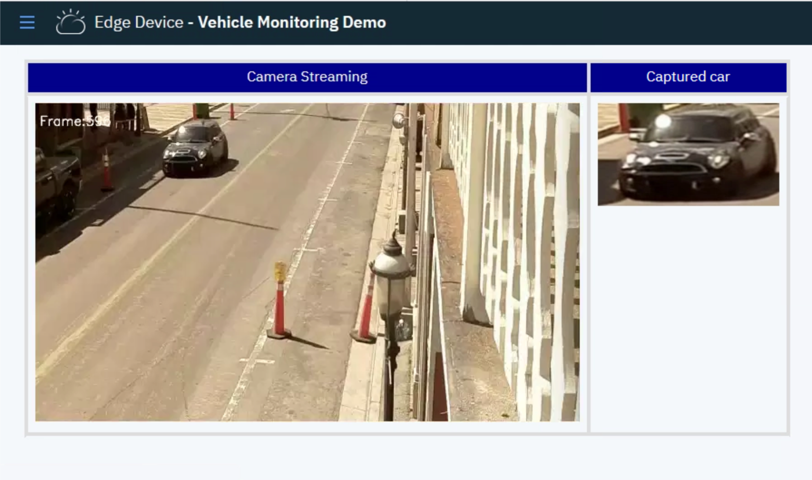

# Think 2020 - Lab 4862: Build an Edge-based Object Detection System Using IBM Edge Computing for Devices and IBM PowerAI Vision

## Speakers

Minsik Lee, Senior Software Engineer, IBM

Naeem Altaf, IBM Distinguished Engineer & CTO Space Tech IBM Cloud, IBM

Poojitha Bikki, Software Developer, IBM

Jose Pablo Monge Bolanos, IT specialist, IBM Cloud Arch. , IBM


## Lab Guide

### Introduction

In this lab, we are going to do real-time video analysis using intelligent edge devices. The machine learning model is centrally trained through Cloud's PowerAI Vision. The trained model is transferred to the edge device using IBM Edge Manager. On the edge device, live streaming data is transmitted in real-time and analyzed using an inference system and the machine learning model.

### High Level Architecture

To analyze real-time sensor data at the edge, edge devices equipped with computing power and analysis software are deployed close to the sensors. In the center, usually cloud or data center, machine learning models can be trained with more computing power, and inference functions can be provided if necessary. The machine learning model created on the central computer is distributed to the edge devices, allowing the edge device to perform inferences using the up-to-dated machine learning model.

  
__Figure. Edge computing architecture for realtime data analysis__  

IBM provides solutions to implement edge computing systems as the followings:

- __PowerAI Vision(IBM Visual Insights)__: PowerAI Vision makes computer vision with deep learning more accessible to business users. It includes an intuitive toolset that empowers subject matter experts to label, train, and deploy deep learning vision models, without coding or deep learning expertise. It includes the most popular deep learning frameworks and their dependencies, and it is built for easy and rapid deployment and increased team productivity. By combining PowerAI Vision software with accelerated IBM® Power Systems™, enterprises can rapidly deploy a fully optimized and supported platform with blazing performance. PowerAI Vision can be deployed on IBM Power Systems for the model training and inference. Inference component can be deployed separately and it supports both of IBM Power Systems and X86 systems.
- __IBM Edge Computing Manager__: IBM Edge Computing Manager for Devices is designed specifically for edge device management to minimize deployment risks and to manage the service software lifecycle on edge devices fully autonomously.IBM Edge Computing Manager for Devices manages service software compliance automatically on edge devices without any manual intervention. On each edge device, decentralized and fully autonomous agent processes run governed by the policies that are specified during the machine registration with IBM Edge Computing Manager for Devices.

### Lab environment

  
__Figure.  Lab configuration__

In the lab, you will access the systems as the followings:

- __Jump Server__: Jump Server uses a local network and provides Windows 10 operating system. Users can access systems in the local network and Internet from the jump server via Firefox or PuTTY.
- __Power AI Vision__: Power AI Vision is deployed on IBM Power System with GPU on IBM Cloud. It provides a web interface for model training, inference, and management. Users can access the server from the jump server via Firefox and train machine learning models.
- __Edge Manager__: In the lab, the edge manager is deployed in the local network and each user has his/her own edge manager. Users are able to access the edge manager via Firefox.
- __Edge Device__: Linux server is used as an edge device in the lab. Instead of the real sensor, a sample streaming file will be used as an input. The image capturing service will read the streaming and detect objects by sending images to the PowerAI Vision Inference. Users will log into the edge device and register the edge device using CLI.

## Getting Started

In the lab, users will review the components of the edge architecture and perform end-to-end tasks to configure the edge device with the machine learning models.

### 1. Log into the jump server

Users can use the jump server to access the systems.
The jump server is a windows server and users will use Firefox, PuTTY, and WinSCP.

  
__Figure. Jump Server__

  1. PuTTY: Use PuTTY to log into the edge device via ssh.
  2. WinSCP: Use WinSCP to send files from the jump server to the edge device.
  3. Firefox: Use Firefox to access the PowerAI Vision, Edge computing manager, and Image Capturing service. Users can use bookmarks in Firefox to access the systems.
  4. Clipboard icon: If users need to copy and paste commands from local PC to the jump server, open a target terminal, editor, or application first, click the clipboard icon, and put the command. Then, users can paste the command in the jump server.
  5. Display icon: Use the display icon to change the screen resolution of the jump server.

### 2. Building a machine learning model in the PowerAI Vision

In this task, users will build a machine learning model with a pre-defined dataset. 

Check an IP address, userid, and password of the Power AI Vision server. Open Firefox and navigate to `https://[IP]/powerai-vision`. Ignore the warning message and continue, then you will see the following screen.

  
__Figure. Power AI Vision page__

Log into the web page with your username and password.

Click `Data Sets` menu. In the `Data Sets` menu, users can upload images to configure a dataset. In the lab, you can import a pre-defined dataset. Click `[Import .zip file]` and select `car.zip` from `Desktop` folder.

  

After the import, you will see the data set. Click the dataset.

  

Click one imported image and see the boundary box for the car. Users can edit the boundary definition. Because the dataset already contains the boundary definition, you can create a machine learning model with no edit.
  

Go back to the data set menu and click `Train model`.
  

In this menu, you will create a new machine learning model. PowerAI Vision supports multiple model types such as Faster R-CNN, YOLO, and Detectron. In this lab, we will use Faster R-CNN. Select `Object detection` and turn on `Advanced settings`.

  

Scroll down and change `Max iteration` value to `1000`. Then click `Train`. The training will take several minutes. If you need to change the option, you can stop the training task and start it with new options again.

  

You will see the training progress status. This task takes about five minutes.
  

_**[Note]** Each `Train model` task consumes one dedicated GPU and each user can use 1 GPU. Please don't trigger `Train Model` multiple times at the same time. In that case, other users are not able to perform this task. If there is no available GPU, please skip the training task and continue the next step. You can come back to this task later._

Congratulations! You completed the Building a machine learning model task.

### (Optional task) Copying the model to the edge device

The machine learning model can be deployed with external tools through the API or can be distributed using Edge Manager's training model management function. In this lab, users will export and upload the model manually. __Users can skip this task because the machine learning model is already copied to the edge device.__

Navigate to 1) `Models` menu, select 2) `CAR_MODEL`, and click 3) `Export Model` button. Please wait until a popup is shown. It takes about 30 seconds. Select 4) `Save File` and 5) `OK` button.


Save the file in `Desktop` directory.  


Click `WinSCP` and log into the edge device.


Select `car_model.zip` and click `Upload`. If necessary, overwrite the file.

 
### 2. Launching PowerAI Vision Inference with the machine learning model on the edge device

The next step is to launch a PowerAI Vision Inference with the machine learning model. Users can use the model to launch PowerAI Vision Inference server in the edge device.

From the jump server, double click `PuTTY` and select `Edge Device`. Then, click `Load` and `Open` button.


Login as `ibmuser`.


Deploy the PowerAI Vision inference server with the model `car_model.zip`.

```bash
/opt/powerai-vision/dnn-deploy-service/bin/deploy_zip_model.sh -m car -p 6001 -g -1 car_model.zip
``` 

This will take about one to two minutes. If you get an error, make sure that you are in your home directory. You can move to your home directory by executing `cd`. The following is an example of the deployment result:



The PowerAI Vision Inference is deployed as a docker container. You can check the powerAI Vision Inference service with the following docker command:

```
docker ps
```

Let's check if the inference function works by sending a sample image using the REST API. Users can send a sample car image to the inference service using `curl` command:

```
curl -F "imagefile=@car.jpg" http://localhost:6001/inference | jq
```

With GPU, it takes less than a hundred milliseconds. In the lab environment, the edge device only has CPU and it takes several seconds. After several seconds, it returns detection confidence and the object boundary information. The following is an example of the result.


Congratulations! You completed the training mode deployment task.

### 3. Deploying the image capturing service

In this task, users will register the edge device to the edge manager. The image capturing service is a docker container built in python. In the lab environment, the docker image is already configured. Once the edge device is registered, the edge agent in the edge device will automatically deploy the image capturing docker container in the edge device.


__Figure. Image Capturing Service__

The configuration will be done using the CLI tool `hzn`. `hzn` is a CLI tool that manages edge devices and applications on the edge devices. In the edge device console, execute the following command to check the registered nodes. Make sure that it returns empty array `[]`.

```
hzn exchange node list 
```

Check an available pattern list which can be deployed on the edge device. The result will include `icp/pattern-detector` which provides streaming capturing service.

```
hzn exchange pattern list
```

Register the edge device with the pattern `icp/pattern-detector`. 

```
hzn register -p icp/pattern-detector
```

You will see the following message.


After the device registration, the edge agent automatically deploys the image capturing service. It will take about one minute. Repeat the following command to monitor the image capturing service deployment status.

```
hzn agreement list
```

Repeat the above command until agreement_creation_time, agreement_accepted_time, agreement_finalized_time, and agreement_execution_start_time are updated.


About one minute later, check the status of `detector` service.

```
docker ps | grep detector
```


Open a Firefox and click the book mark `Vehicle Monitoring` or navigate to `http://10.0.10.3:3000`



_**[note]** In this lab, the edge device only uses CPU and the detection takes several seconds. If the GPU is used, the detection time will be less than 100 milliseconds per frame._

If you have a problem with the edge node registration, you can manually launch the image capturing service.

```bash
docker run --rm -p 3000:3000 detector:1.0.0
```

Congratulations! You completed the image capturing service deployment task.

### 4. Explore Edge Manager Web menu(Optional)

Click the bookmark `Edge Manager`. If the page is redirected to the login page, log into the web page and click `Edge Manager` again.

In the `Nodes` tab, you can see the status of the registred nodes.


Navigate to `Services` tab. You can see the `detector` service that is deployed on the edge device.


Congratulations! You completed the end-to-end deployment tasks.

</details>